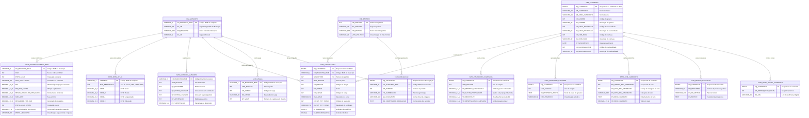

```mermaid
erDiagram

    %% DIMENSÕES (Entidades Principais)

    DIM_MUNICIPIO {
        VARCHAR_7 CD_MUNICIPIO_IBGE PK "Código IBGE de 7 dígitos"
        VARCHAR_10 SG_UE "Sigla/Código TSE do Município"
        VARCHAR_100 NM_MUNICIPIO "Nome oficial do Município"
        VARCHAR_2 SG_UF "Sigla do Estado"
    }

    DIM_PARTIDO {
        INT NR_PARTIDO PK "Número do partido"
        VARCHAR_20 SG_PARTIDO "Sigla do partido"
        VARCHAR_100 NM_PARTIDO "Nome oficial do partido"
        VARCHAR_20 VIES_POLITICO "Classificação de Viés Político"
    }

    DIM_CANDIDATO {
        BIGINT SQ_CANDIDATO PK "Sequencial do candidato no TSE"
        VARCHAR_150 NM_CANDIDATO "Nome completo"
        VARCHAR_150 NM_URNA_CANDIDATO "Nome de urna"
        INT CD_GENERO "Código do gênero"
        VARCHAR_20 DS_GENERO "Descrição do gênero"
        INT CD_GRAU_INSTRUCAO "Código da escolaridade"
        VARCHAR_50 DS_GRAU_INSTRUCAO "Descrição da escolaridade"
        INT CD_COR_RACA "Código de cor/raça"
        VARCHAR_30 DS_COR_RACA "Descrição de cor/raça"
        DATE DT_NASCIMENTO "Data de nascimento"
        INT CD_NACIONALIDADE "Código de nacionalidade"
        VARCHAR_50 DS_NACIONALIDADE "Descrição da nacionalidade"
    }

    %% TABELAS FATO ELEITORAIS (TSE)

    FATO_CANDIDATURA {
        BIGINT SQ_CANDIDATO FK "Sequencial do candidato"
        VARCHAR_7 CD_MUNICIPIO_IBGE FK "Código IBGE do município"
        INT NR_PARTIDO FK "Número do partido"
        INT ANO_ELEICAO "Ano do pleito"
        INT CD_ELEICAO "Código da eleição"
        INT NR_TURNO "Turno"
        INT CD_CARGO "Código do cargo"
        VARCHAR_50 DS_CARGO "Descrição do cargo"
        INT CD_SIT_TOT_TURNO "Código de resultado"
        VARCHAR_50 DS_SIT_TOT_TURNO "Resultado do candidato"
        CHAR_1 ST_REELEICAO "Indicador de reeleição"
        CHAR_1 ST_DECLARAR_BENS "Indicador de bens"
    }

    FATO_FINANCEIRO_CAMPANHA {
        BIGINT SQ_CANDIDATO FK "Sequencial do candidato"
        INT ANO_ELEICAO "Ano da eleição"
        DECIMAL_15_2 VR_DESPESA_CONTRATADA "Total de gastos contratados"
        DECIMAL_15_2 VR_GASTO_PROPAGANDA "Gastos em propaganda/mídia"
        DECIMAL_15_2 VR_RECEITA_PJ "Doações/Recursos de PJ"
        DECIMAL_15_2 VR_DESPESA_MAX_CAMPANHA "Limite de gastos legal"
    }

    FATO_VOTACAO_MUNICIPIO {
        VARCHAR_7 CD_MUNICIPIO_IBGE FK "Código IBGE do município"
        INT ANO_ELEICAO "Ano da eleição"
        INT QT_ELEITORES "Eleitores aptos"
        INT QT_VOTOS_NOMINAIS "Votos diretos em candidatos"
        INT QT_VOTOS_LEGENDA "Votos em legenda/partido"
        INT QT_ABSTENCAO "Eleitores ausentes"
        DECIMAL_5_2 PCT_ABSTENCAO "Percentual de abstenção"
    }

    FATO_PROPOSTA_GOVERNO {
        BIGINT SQ_CANDIDATO FK "Sequencial do candidato"
        INT ANO_ELEICAO "Ano da eleição"
        TEXT DS_PROPOSTA_TEXTO "Texto do plano de governo"
        VARCHAR_50 EIXO_TEMATICO "Classificação temática"
    }

    FATO_BEM_CANDIDATO {
        BIGINT SQ_CANDIDATO FK "Sequencial do candidato"
        INT NR_ORDEM_BEM_CANDIDATO "Sequencial do bem"
        INT CD_TIPO_BEM_CANDIDATO "Código da categoria do bem"
        VARCHAR_100 DS_TIPO_BEM_CANDIDATO "Categoria do bem"
        TEXT DS_BEM_CANDIDATO "Detalhamento do bem"
        DECIMAL_15_2 VR_BEM_CANDIDATO "Valor em reais"
    }

    FATO_VAGAS {
        VARCHAR_7 CD_MUNICIPIO_IBGE FK "Código IBGE do município"
        INT ANO_ELEICAO "Ano do pleito"
        INT CD_CARGO "Código do cargo"
        VARCHAR_50 DS_CARGO "Descrição do cargo"
        INT QT_VAGA "Número de cadeiras em disputa"
    }

    FATO_COLIGACAO {
        BIGINT SQ_COLIGACAO "Sequencial único da coligação"
        VARCHAR_7 CD_MUNICIPIO_IBGE FK "Código IBGE do município"
        INT NR_PARTIDO FK "Número do partido"
        VARCHAR_20 TP_AGREMIACAO "Tipo de agremiação"
        VARCHAR_150 NM_COLIGACAO "Nome oficial da coligação"
        TEXT DS_COMPOSICAO_COLIGACAO "Composição dos partidos"
    }

    FATO_MOTIVO_CASSACAO {
        BIGINT SQ_CANDIDATO FK "Sequencial do candidato"
        VARCHAR_50 NR_PROCESSO "Número do processo judicial"
        VARCHAR_100 DS_TP_MOTIVO "Tipo de motivo"
        TEXT DS_MOTIVO "Fundamentação jurídica"
    }

    FATO_REDE_SOCIAL_CANDIDATO {
        BIGINT SQ_CANDIDATO FK "Sequencial do candidato"
        INT NR_ORDEM_REDE_SOCIAL "Sequência do link"
        VARCHAR_255 DS_URL "Link do perfil/canal digital"
    }

    %% TABELAS FATO SOCIOECONÔMICAS (IBGE & ATLAS)

    FATO_SOCIOECONOMICO_IBGE {
        VARCHAR_7 CD_MUNICIPIO_IBGE FK "Código IBGE do município"
        INT ANO "Ano do indicador IBGE"
        INT POPULACAO "População residente"
        VARCHAR_20 TIPO_POPULACAO "Censitária ou Estimada"
        DECIMAL_18_2 PIB "PIB municipal a preços correntes"
        DECIMAL_12_2 PIB_PER_CAPITA "PIB per capita oficial"
        DECIMAL_10_2 RENDA_DOMICILIAR_PER_CAPITA "Renda média domiciliar"
        DECIMAL_10_2 AREA_KM2 "Área em km²"
        DECIMAL_10_2 DENSIDADE_HAB_KM2 "Densidade demográfica"
        INT POPULACAO_JOVEM "População jovem"
        DECIMAL_5_2 PORCENTAGEM_SUPERIOR "Percentual com ensino superior"
        VARCHAR_30 PERFIL_MUNICIPIO "Classificação populacional x riqueza"
    }

    FATO_IDHM_ATLAS {
        VARCHAR_7 CODMUN7 FK "Código IBGE de 7 dígitos"
        INT ANO_REFERENCIA "Ano do Censo (1991, 2000, 2010)"
        DECIMAL_5_3 IDHM "IDHM Geral"
        DECIMAL_5_3 IDHM_R "IDHM Renda"
        DECIMAL_5_3 IDHM_L "IDHM Longevidade"
        DECIMAL_5_3 IDHM_E "IDHM Educação"
    }

    %% RELACIONAMENTOS (Cardinalidades)

    DIM_MUNICIPIO ||--o{ FATO_SOCIOECONOMICO_IBGE : "possui estatísticas"
    DIM_MUNICIPIO ||--o{ FATO_IDHM_ATLAS : "possui indicadores"
    DIM_MUNICIPIO ||--o{ FATO_VOTACAO_MUNICIPIO : "registra votos"
    DIM_MUNICIPIO ||--o{ FATO_CANDIDATURA : "sedia candidaturas"
    DIM_MUNICIPIO ||--o{ FATO_VAGAS : "oferta vagas"
    DIM_MUNICIPIO ||--o{ FATO_COLIGACAO : "abriga coligações"

    DIM_CANDIDATO ||--o{ FATO_CANDIDATURA : "registra pleitos"
    DIM_CANDIDATO ||--o{ FATO_FINANCEIRO_CAMPANHA : "presta contas"
    DIM_CANDIDATO ||--o{ FATO_PROPOSTA_GOVERNO : "apresenta plano"
    DIM_CANDIDATO ||--o{ FATO_BEM_CANDIDATO : "declara patrimônio"
    DIM_CANDIDATO ||--o{ FATO_MOTIVO_CASSACAO : "possui processos"
    DIM_CANDIDATO ||--o{ FATO_REDE_SOCIAL_CANDIDATO : "informa canais"

    DIM_PARTIDO ||--o{ FATO_CANDIDATURA : "lança candidatos"
    DIM_PARTIDO ||--o{ FATO_COLIGACAO : "compõe agremiações"

```

[[EDR - Projeto da disciplina]] [[ER.canvas]]